# ✦ EduTrack — Student Management Dashboard

> A full-stack academic management dashboard built with **React + Flask** to manage students, courses, reports, authentication, and admin workflows in one clean professional interface.

---

## 📌 Project Overview

**EduTrack** is a modern full-stack dashboard designed for schools, universities, and training programs.  
It helps academic teams manage student records, organize courses, monitor performance, export reports, and work with protected admin pages through a responsive and reusable UI system.

---

## 🖼️ Project Preview

> Replace the placeholders below with your own screenshots.

### ✦ Authentication Pages

#### Sign Up Page
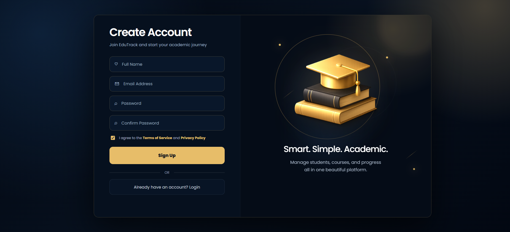

#### Login Page
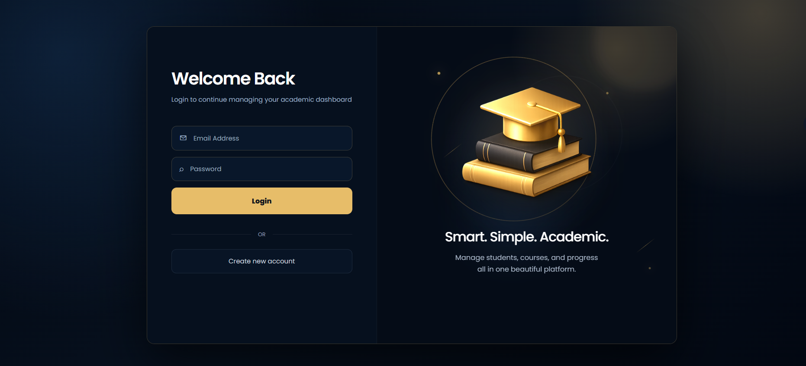

---

### ✦ Dashboard

The dashboard includes real API analytics, student statistics, course summaries, GPA charts, system activity, and admin tasks.

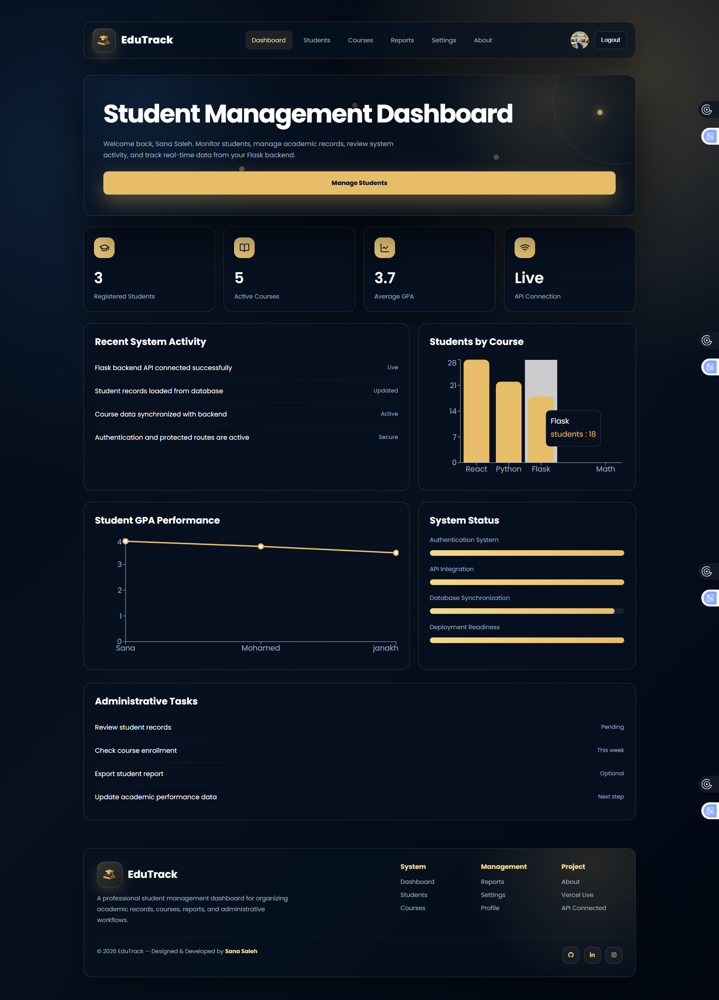

---

### ✦ Navbar

Responsive navigation with active links, profile avatar, logout button, and EduTrack branding.

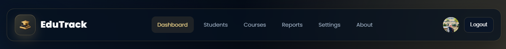

---

### ✦ Student Management

Students can be viewed, added, edited, deleted, searched, filtered, paginated, and connected to existing courses.

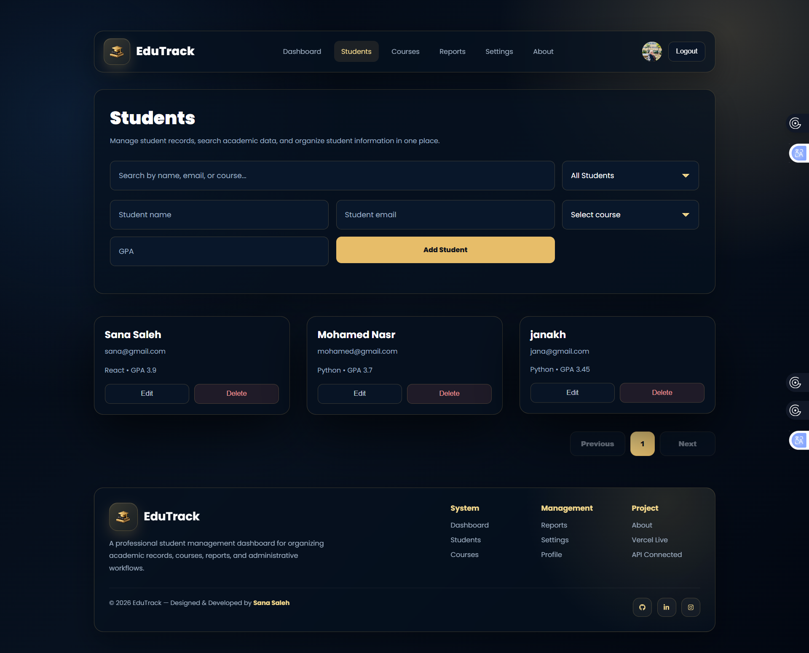

---

### ✦ Add / Edit Student

The student form supports full name, email, course selection from existing courses, GPA, validation, and notifications.

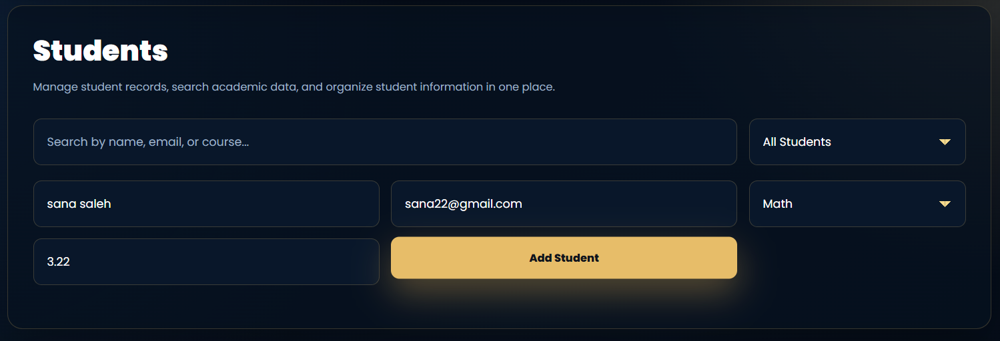

---

### ✦ Student Details Page

Each student has an individual details page with academic summary, contact information, recent activity, and performance overview.

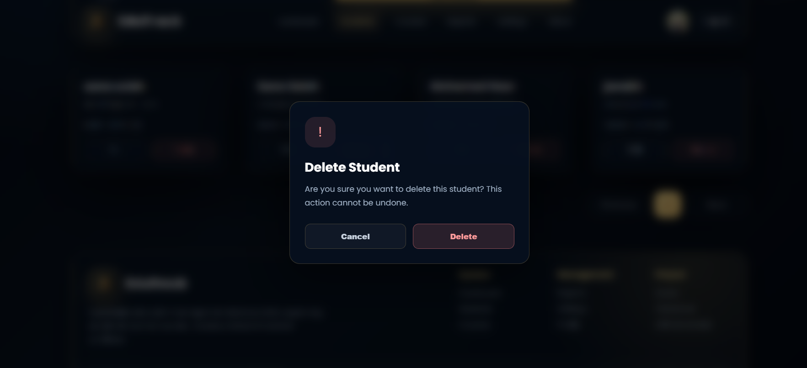

---

### ✦ Courses Page

Courses can be added, edited, deleted, and used later when assigning students.

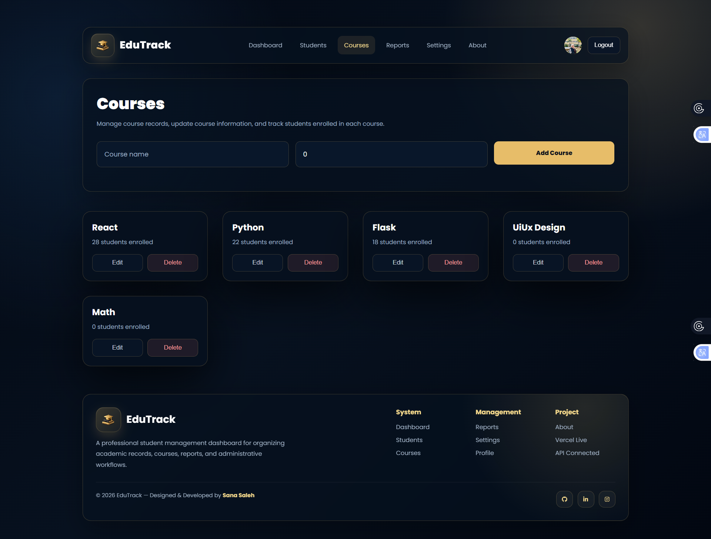

---

### ✦ Reports Page

The reports page summarizes academic data and supports CSV export.

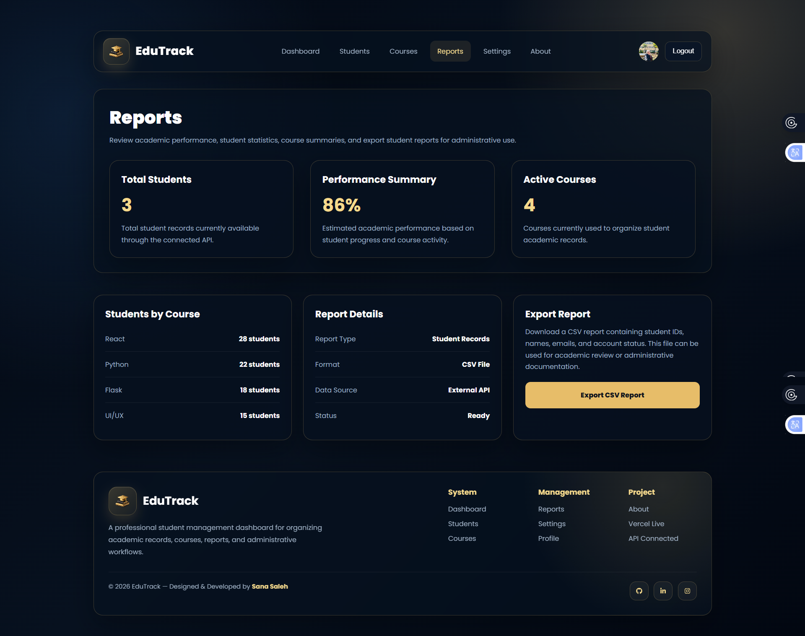

---

### ✦ Profile Page

The profile page supports updating admin information and uploading a profile image that remains visible in the navbar.

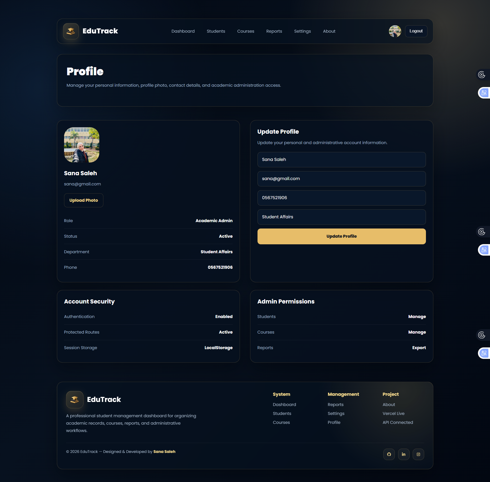

---

### ✦ Settings Page

The settings page displays system mode, security status, API health, environment, and project configuration.

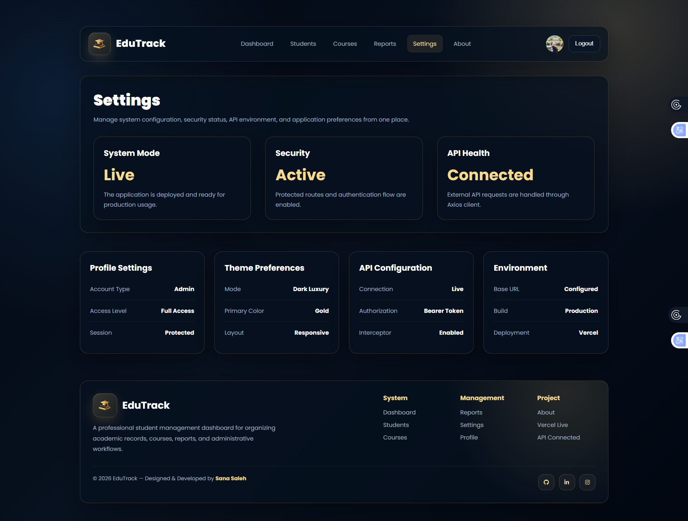

---

### ✦ About Page

The about page explains EduTrack features, system capabilities, and the technology stack.

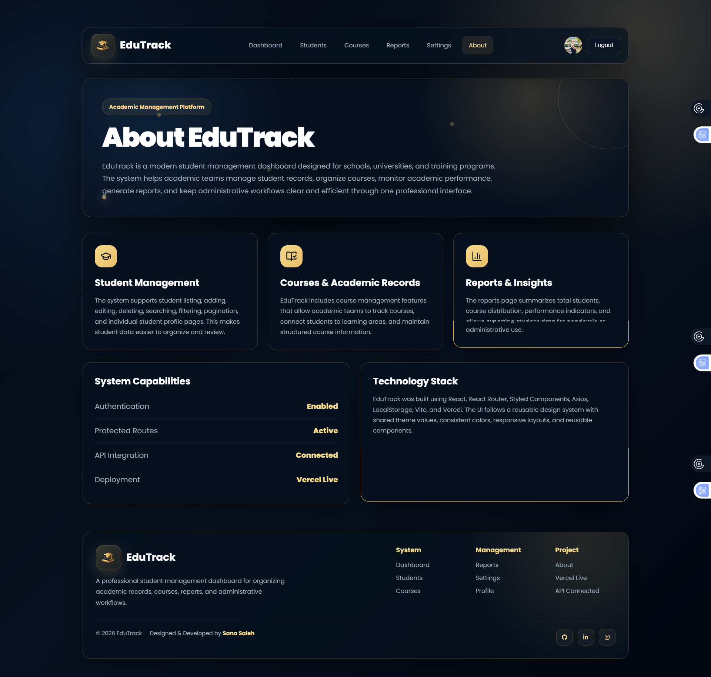

---

### ✦ Footer

Footer includes project links, management links, author credit, and social media icons.

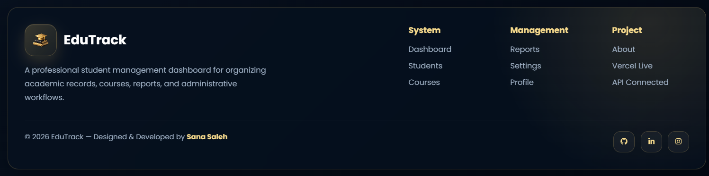

---

## ✨ Features

### 🔐 Authentication
- User registration
- User login
- Logout
- JWT authentication
- Protected routes
- Session stored in `localStorage`

### 🎓 Student Management
- View all students
- Add new student
- Edit student
- Delete student
- Confirmation modal before delete
- Search by name, email, or course
- Filter students
- Pagination
- Student details page
- Course selection from available courses
- GPA support

### 📚 Course Management
- View courses
- Add course
- Edit course
- Delete course
- Courses connected with student creation

### 📊 Dashboard Analytics
- Total registered students
- Active courses
- Average GPA
- API connection status
- Students by course chart
- Student GPA performance chart
- System status progress cards
- Recent activity section

### 📄 Reports
- Student statistics
- Course distribution
- CSV export
- Report summary cards

### 👤 Profile
- Update name and email
- Add phone and department
- Upload profile image
- Profile image shown in navbar
- Persistent profile data

### 🎨 UI / UX
- Fully responsive layout
- Styled Components design system
- Reusable UI components
- Clean dark luxury theme
- Toast notifications
- Custom confirmation modal
- Modern icons
- Professional dashboard layout

---

## 🧱 Tech Stack

### Frontend
- React
- Vite
- React Router
- Styled Components
- Axios
- React Hook Form
- Yup Validation
- Recharts
- Lucide React
- React Icons
- LocalStorage

### Backend
- Flask
- Flask-CORS
- Flask-SQLAlchemy
- Werkzeug Security
- PyJWT
- Gunicorn
- SQLite

### Deployment
- Frontend: Vercel
- Backend: Render

---

## 📁 Project Structure

```txt
edutrack-app/
│
├── frontend/
│   ├── public/
│   ├── src/
│   │   ├── api/
│   │   ├── assets/
│   │   ├── components/
│   │   ├── context/
│   │   ├── hooks/
│   │   ├── pages/
│   │   ├── routes/
│   │   ├── ui/
│   │   ├── App.jsx
│   │   └── main.jsx
│   ├── .env.local
│   ├── .env.production
│   ├── package.json
│   └── vite.config.js
│
├── backend/
│   ├── app.py
│   ├── config.py
│   ├── models.py
│   ├── seed.py
│   ├── requirements.txt
│   └── routes/
│       ├── auth.py
│       ├── students.py
│       └── courses.py
│
├── screenshots/
│   ├── signup.png
│   ├── login.png
│   ├── dashboard.png
│   ├── navbar.png
│   ├── students.png
│   ├── student-form.png
│   ├── student-details.png
│   ├── courses.png
│   ├── reports.png
│   ├── profile.png
│   ├── settings.png
│   ├── about.png
│   └── footer.png
│
└── README.md
```

---

## 🔗 API Endpoints

### Authentication

| Method | Endpoint | Description |
|---|---|---|
| POST | `/api/auth/register` | Create new account |
| POST | `/api/auth/login` | Login user |
| PUT | `/api/auth/profile` | Update profile |

### Students

| Method | Endpoint | Description |
|---|---|---|
| GET | `/api/students` | Get all students |
| POST | `/api/students` | Add student |
| PUT | `/api/students/:id` | Update student |
| DELETE | `/api/students/:id` | Delete student |

### Courses

| Method | Endpoint | Description |
|---|---|---|
| GET | `/api/courses` | Get all courses |
| POST | `/api/courses` | Add course |
| PUT | `/api/courses/:id` | Update course |
| DELETE | `/api/courses/:id` | Delete course |

---

## 🧑‍🎓 Student Model

```json
{
  "id": 1,
  "name": "Sana Saleh",
  "email": "sana@gmail.com",
  "course": "React",
  "gpa": 3.9,
  "status": "Active"
}
```

---

## ⚙️ Environment Variables

### Frontend

Create `.env.local` inside `frontend/` for local development:

```env
VITE_API_BASE_URL=http://127.0.0.1:5000/api
```

Create `.env.production` inside `frontend/` for production:

```env
VITE_API_BASE_URL=https://your-backend-service.onrender.com/api
```

---

## 🚀 Running Locally

### 1. Clone the repository

```bash
git clone https://github.com/SanaMahmoodd/edutrack-app.git
cd edutrack-app
```

### 2. Run Backend

```bash
cd backend
python -m venv venv
source venv/Scripts/activate
pip install -r requirements.txt
python app.py
```

Backend runs on:

```txt
http://127.0.0.1:5000
```

### 3. Run Frontend

```bash
cd frontend
npm install
npm run dev
```

Frontend runs on:

```txt
http://localhost:5173
```

---

## 🌍 Deployment

### Frontend — Vercel

```txt
Framework Preset: Vite
Root Directory: frontend
Build Command: npm run build
Output Directory: dist
Install Command: npm install
```

### Backend — Render

```txt
Runtime: Python 3
Root Directory: backend
Build Command: pip install -r requirements.txt
Start Command: gunicorn app:app
```

---

## 🔑 Demo Account

You can use the following demo account to test the dashboard:

```txt
Email: sana@gmail.com
Password: 132004
```
---

## 🧪 Testing Checklist

- [ ] Sign up works
- [ ] Login works
- [ ] Logout works
- [ ] Protected routes work
- [ ] Students load from API
- [ ] Add student works
- [ ] Edit student works
- [ ] Delete student works
- [ ] Confirmation modal works
- [ ] Course dropdown loads real courses
- [ ] GPA accepts decimals
- [ ] Search works
- [ ] Filters work
- [ ] Pagination works
- [ ] Courses CRUD works
- [ ] Dashboard charts load real data
- [ ] CSV export works
- [ ] Profile image upload works
- [ ] Navbar profile image updates
- [ ] Footer links and icons show correctly
- [ ] App is responsive
- [ ] Vercel deployment works
- [ ] Render backend works

---

## 🏆 Bonus Features Implemented

- JWT authentication
- Real charts using Recharts
- CSV export
- Toast notifications
- Delete confirmation modal
- Profile image upload
- Full-stack API integration
- Deployed frontend and backend
- Clean folder organization
- Reusable UI system

---

## 🌍 Live Deployment

| Service | Link |
|---|---|
| Frontend | https://your-vercel-link.vercel.app |
| Backend API | https://your-backend-link.onrender.com |

---
## 👩‍💻 Author

**Designed & Developed by Sana Saleh**

- GitHub: [SanaMahmoodd](https://github.com/SanaMahmoodd)
- LinkedIn: LinkedIn: https://www.linkedin.com/in/sana-saleh2004

---

## 📌 Final Note

EduTrack was built as a final full-stack training project to practice real-world frontend and backend integration.  
The project focuses on clean UI, reusable components, API communication, authentication, CRUD operations, responsive design, and deployment readiness.

---